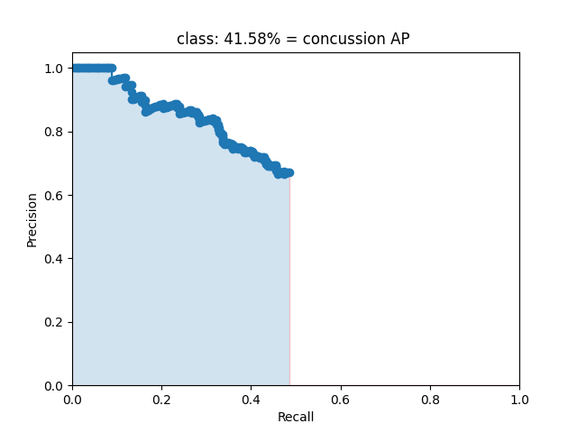
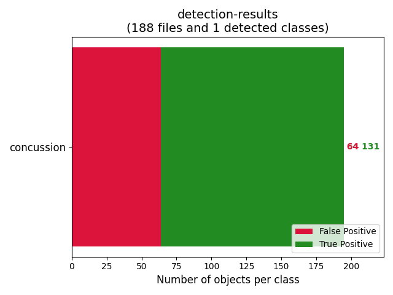
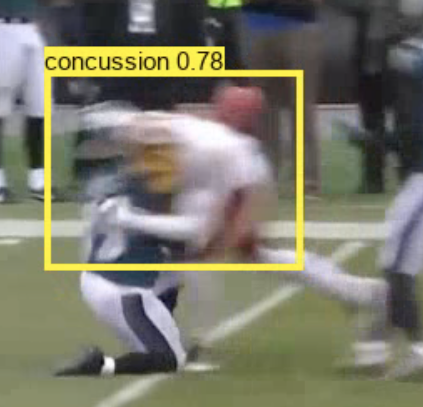
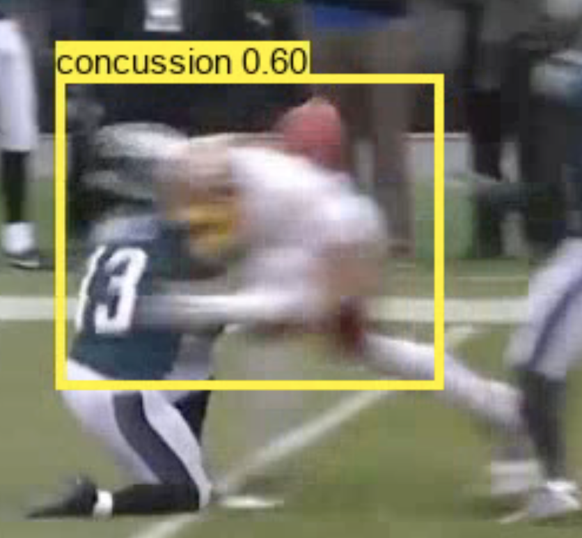
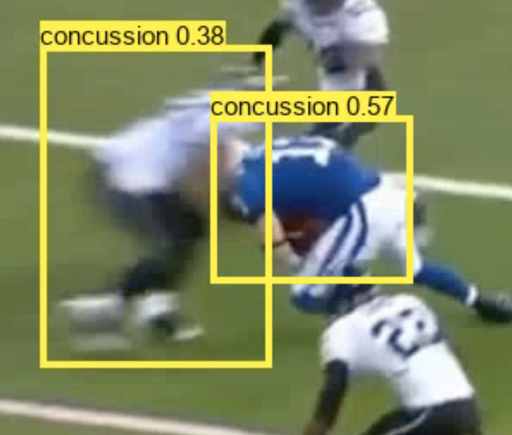
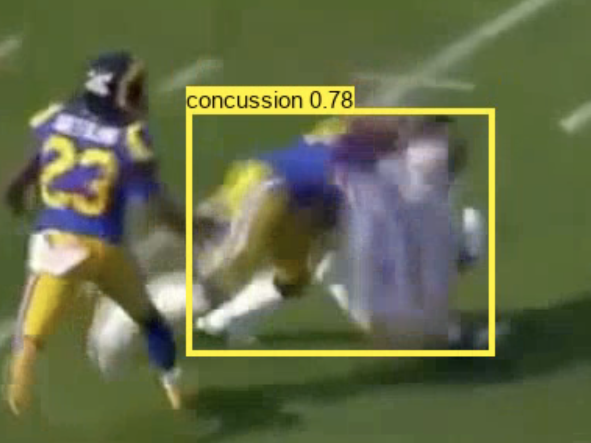

# CODEC

Concussion Detection Via Computer Vision 🏈

CODEC is an end-to-end pipeline capable of detecting concussions by analyzing videos of tackles and contact between football players. 
 
## Abstract
In this project, we aimed to alleviate the problem of concussion in football by introducing a state of the art application for object detection on media files (video/images).

We developed an end-to-end pipeline, CODEC, which has the ability to perform single shot detection of football gametape and produces real time classification of concussion hits as output.

To achieve these results, and with the goal of further productionalizing the concept, we decided to use the best available object detection algorithm on the market, YOLOv3.

The original YOLO algorithm was authored in C, but for this project, we used an adapted python version, along with tensorflow and openCV. The model was trained on over 800 samples of video footage.

For both speed and accuracy, we use mean average precision as our go-to metric. Although we tweaked our model using various optmizers, learning rate, schedulers and hyper-parameters, most of our time was spent scraping the web for data.

We used "roboflow" to breakdown videos and images, annotate them and convert them in a format our model can work with. 

## Problem Statement

The average life expectancy of an NFL player is between 53 to 59 years. In comparison the average lifespan of an American is 79 years. Primarily, the two factors are responsible for this low life expectancy are: 

- Cardiovascular disease
- Neurodegenerative disease (CTE)

Over the past few decades, the world has realized how deadly concussions can be. According to a paper from 2010, it is estimated that NFL has about 140 concussions every year. Acccording to published research, people with ~5 concussions are at an increased risk for long-term impairment, such as forgetfulness, balance issues, and more. 

Concussions typically vary a lot in terms of symptoms visible. While it is easy to detect in some cases, sometimes it can go unnoticed. According to a study from 2013, nearly a third of football athletes have undiagonised concussions.

Through this project, we intend to make concussion detection in football easier!

## Related Work

- YOLOv3: https://arxiv.org/pdf/1506.02640.pdf

- Datastore and DataGenerator– roboflow: https://blog.roboflow.com/training-a-yolov3-object-detection-model-with-a-custom-dataset/

- Undiagonised concussion paper: https://www.ncbi.nlm.nih.gov/pmc/articles/PMC3758800/

## Methodology

### Data Collection

Arguably the most time consuming and difficult part of this project was scraping the internet for footage of football hits. 

This part involved getting data and manually annotating it for concussion and no-concussion. For this we used Youtube videos and the NFL datalog of injuries.

### Data Preparation

It is difficult to maintain, store and generate data for object detection tasks, so to overcome this hurdle, we used an open source platform called roboflow, which stored our images and annotations. 

Along with this, it also provided us power to augment data, split data and more importantly generate an API key which our training model could use to fetch the images and annotations. 

### Training

Since we used an open source definition of Yolov3 in tensorflow, the training scripts were largely abstracted. 

First, we defined the model architecture in tensorflow (series of convolution blocks and residual connections). Since the original model was defined in C, we had to get the pretrained weights and convert those into .h5, the format used by tensorflow. We downloaded these pretrained weights from Joe's website. 

Next, we instantiated our model, defined our optimizer (Adam), loss function, learning rate scheduler, and hyperparameters. Following this, we called the our train function. The training is done in a unique way, where we first freeze some layers of the model to stabilize the training loss, following which we unfreeze the model and train it end to end. For training we also required help generating data and defining anchor boxes, for which we used open source definitions. 

The learning rate scheduler (ReduceLROnPlateau) tweaks the learning rate by decaying it whenever it notices that the validation loss is being plateaued. To save the model's progress, we decided to check point using the ModelCheckpoint class and defined validation loss as our metric to monitor and saved every 3 epochs, training for a total time of 300 epochs(200 freeze + 100 unfreezed). All of our training was done on Google Colab.

### Inferencing

This part was done using a python script and openCV to take in an image/video and performing detection on them by calling the model.predict() function. To abstract this process, we used the detect_image function. To handle video data, we split up the video into frames and then ran our model on each individual frame and stitched the result back together. In order to inference, we first have to load the model weights data(the .h5 files) and call the model.load() function to load these weights and then used this model to run our inferencing on.

## Experiments/Evaluation and Results

We used mean average precision (mAP) as our evalutation metric. Most state of the art object detection models use this metric for evaluation purposes, making us confident in its ability to judge model performance accurately. 

The graph below charts precision vs recall over multiple images. We use this calculate AP by finding the area under the precision-recall curve. We ended up with concussion AP of 41.58%. 

 

Over the 188 image samples we tested our model on we had 131 true positives and 64 false positives for concussion. 

## Examples

Some output results from our model: 

## What's Next?

### Model Research

We consider our project to be an application driven project, where we handpicked the best available model and applied it in a new context. That said, there is still scope for further model improvements. Instead of YoloV3, we can look at various other models(retina net, SSD). Additionaly, we believe some performance may be lost in translating the code from C to python. As such, there is scope to to examine the python version of YOLO and rewrite portions of it for better perfromance. Finally, we believe the project can be made better by developing the model in pytorch, rather than tensorflow, which will allow for a deeper dive and possibly faster execution and inference times 

### Tracking

Bounding boxes are drawn in every frame of a video. This is because our model predicts on every frame individually, without considering past events. A tracking algorithm (like DEEP SORT would allow us to track the progression of bounding boxes across frames, allowing us to see how a bounding box develops over time. This would be an invaluable feature that will allow our model to perform better in real world situations. 

